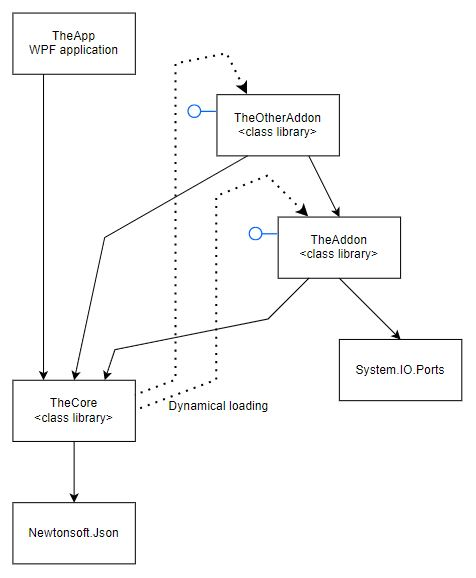

# Net5AddonLoadProblemDemo

## New Problem
The __Newtonsoft.Json.Serialization.DefaultContractResolver__ can not load the assembly for a plugin used by another plugin when using the ResolveContract medhod.

In this code, TheCore will dynamically load both plugins, first TheAddon, then TheOtherAddon. 



When loading TheOtherAddon, the GetSomeType function returns the type for the ClassUsingSomeClass class. 
That class has a property with the type of a SomeClass reference, a type that is defined in the TheAddon assembly.

When __DefaultContractResolver.ResolveContract__ is called, to create a contract for a ClassUsingSomeClass object, this exception is thrown:

__Could not load file or assembly 'TheAddon, Version=1.0.0.0, Culture=neutral, PublicKeyToken=null'. The system cannot find the file specified.__

Callstack:
```
   at System.Signature.GetSignature(Void* pCorSig, Int32 cCorSig, RuntimeFieldHandleInternal fieldHandle, IRuntimeMethodInfo methodHandle, RuntimeType declaringType)
   at System.Reflection.RuntimeMethodInfo.<get_Signature>g__LazyCreateSignature|25_0()
   at System.Reflection.RuntimeMethodInfo.FetchNonReturnParameters()
   at System.Reflection.RuntimeMethodInfo.GetParameters()
   at Newtonsoft.Json.Serialization.DefaultContractResolver.GetCallbackMethodsForType(Type type, List`1& onSerializing, List`1& onSerialized, List`1& onDeserializing, List`1& onDeserialized, List`1& onError)
   at Newtonsoft.Json.Serialization.DefaultContractResolver.ResolveCallbackMethods(JsonContract contract, Type t)
   at Newtonsoft.Json.Serialization.DefaultContractResolver.InitializeContract(JsonContract contract)
   at Newtonsoft.Json.Serialization.DefaultContractResolver.CreateObjectContract(Type objectType)
   at Newtonsoft.Json.Serialization.DefaultContractResolver.CreateContract(Type objectType)
   at System.Collections.Concurrent.ConcurrentDictionary`2.GetOrAdd(TKey key, Func`2 valueFactory)
   at Newtonsoft.Json.Utilities.ThreadSafeStore`2.Get(TKey key)
   at Newtonsoft.Json.Serialization.DefaultContractResolver.ResolveContract(Type type)
   at TheCore.AddonLoader.LoadAndActivateAddon(String path) in Net5AddonLoadProblemDemo\\TheCore\\AddonLoader.cs:line 69
   at TheCore.AddonLoader.LoadAndActivateAllAddons() in Net5AddonLoadProblemDemo\\TheCore\\AddonLoader.cs:line 46
   at TheApp.MainWindow.button_Click(Object sender, RoutedEventArgs e) in Net5AddonLoadProblemDemo\\TheApp\\MainWindow.xaml.cs:line 33"
```


## Old Problem - now fixed !!
Files demonstrating the problem with load of System.IO.Ports.dll when used from addon class library in .NET 5

When the WPF application TheApp is started and the UI button is pressed, the assembly TheAddon.dll is loaded via reflection, the class AddonMain is instantiated and its method 'Action' is called.

At the moment 'Action' is called, this error happens:

```
System.IO.FileNotFoundException
  HResult=0x80070002
  Message=Could not load file or assembly 'System.IO.Ports, Version=5.0.0.0, Culture=neutral, PublicKeyToken=cc7b13ffcd2ddd51'. The system cannot find the file specified.
  Source=TheAddon
  StackTrace:
   at TheAddon.AddonMain.Action() in C:\SW_development\JustTry\Net5AddonLoadProblemDemo\TheAddon\AddonMain.cs:line 12
   at TheCore.AddonLoader.LoadTheAddon() in C:\SW_development\JustTry\Net5AddonLoadProblemDemo\TheCore\AddonLoader.cs:line 16
   at TheApp.MainWindow.button_Click(Object sender, RoutedEventArgs e) in C:\SW_development\JustTry\Net5AddonLoadProblemDemo\TheApp\MainWindow.xaml.cs:line 30
   .
   .
   .
   at System.Windows.Application.Run()
   at TheApp.App.Main()
```

It makes no difference to use version 5.0.1 or 6.0.0 of System.IO.Ports.dll.

I also added another WPF applicalication (TheDirectUserApp) that directly has a project reference to TheAddon. That makes the application load the System.IO.Ports.dll directly when started, and everything works.
But that's not what I want. I don't wish to have hard references to all my addons from all my wpf and console applications.

As a side effect, I now get a System.PlatformNotSupportedException ("System.IO.Ports is currently only supported on Windows") if TheDirectUserApp has been executed before TheApp.
Building TheDirectUserApp creates the "runtimes" folder in the output folder, where System.IO.Ports.dll can be found in runtimes\win\lib\netstandard2.0 (not net5.0 !!). At the same time System.IO.Ports.dll is also copied directly into the output folder.
